# xmcloud-edge-webhook-management-tool
Sitecore powershell **(SPE) module** experience edge webhook management module to create/update and delete webhooks of the edge admin API. Useful for developers for managing the webhooks.

# INSTALLATION

This tool can be added without code to any environment.

**Step 1**: Install the Sitecore Package.

Download the Sitecore Package from this repo (JSONViewer_SitecorePackage_2024-09-24.zip).

Install on your XM Cloud environments:

- Navigate to the XM Cloud tools screen by visiting https://xmapps.sitecorecloud.io/tools.
- Select Utilities and then click Control Panel.
- Under the Administration section, choose Install a package.
Repeat these steps for each environment where you want to install the package.

This package adds the following Sitecore Powershell Context Menu Extensions and Function items:

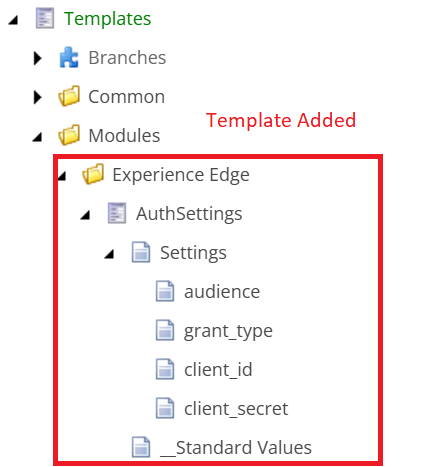

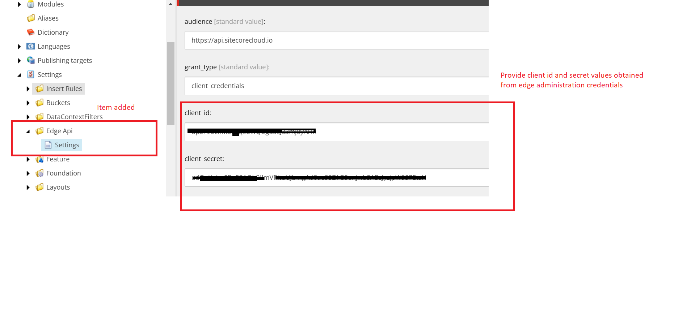

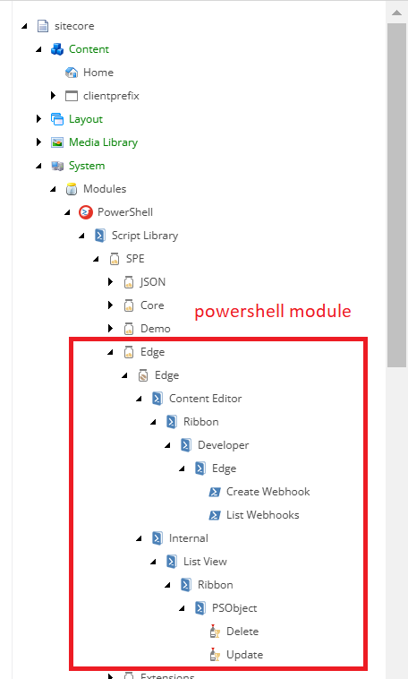

**Step 2**: Update the Client id and client secret from edge administration tool

- Navigate to xm cloud deploy app from the sitecore cloud portal.
- In the left navigation, select Credentials.
- Under the Environment tab, click Create credentials.
- From the dropdown, select Edge administration, which opens a modal where you’ll need to provide environment details.
- Click Create to generate the client ID and client secret. Copy the id and secret.
- Now navigate to **/sitecore/system/Settings/Edge Api/Settings** and provide the id and secret copied in the fields client_id and client_secret.
- Refer this blog https://jagadheeshblog.wordpress.com/2024/11/11/sitecore-xm-cloud-clearing-the-edge-cache/ for detailed explanation to get the client id and secret values.

**Step 3**: Sync powershell library with content editor ribbon

- Navigate to powershell ISE https://{sitecore_host}/sitecore/shell/Applications/PowerShell/PowerShellIse.
- click on settings->Rebuild All dropdown ->Sync Library with Content Editor Ribbon.

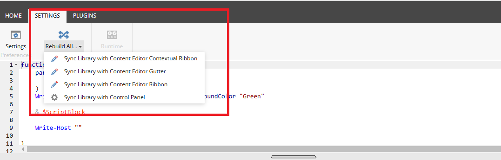

**Step 4**: Enable Developer tab on ribbon

- Navigate to the sitecore desktop and right click ribbon.
- Select Developer from the list if the developer tab is not enabled

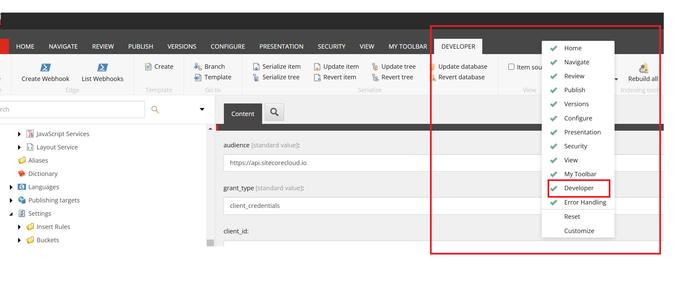

**Demo Screenshots**

Ribbon buttons 
- Create webhook - to create new webhook
- List webhooks - list out the webhooks 

    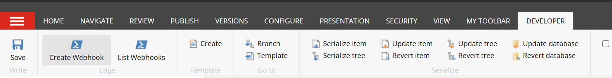

- Create webhook interface

    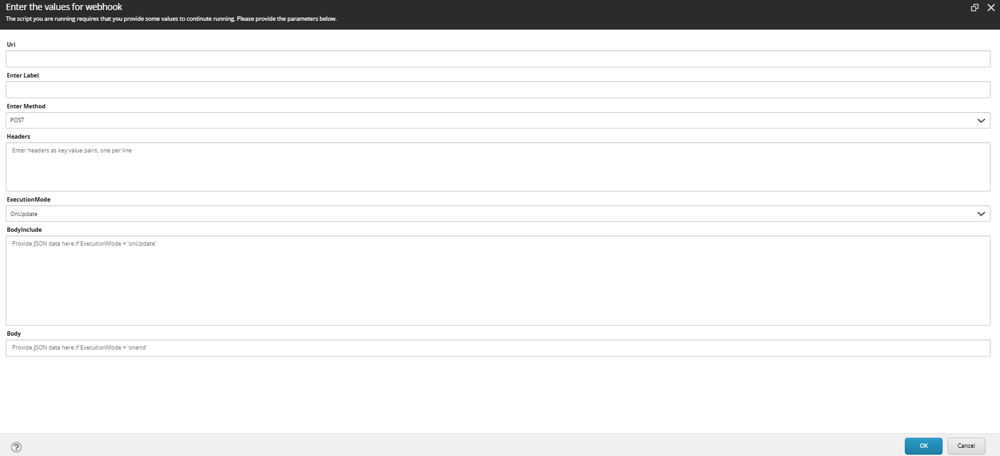

- Create webhook confirmation

    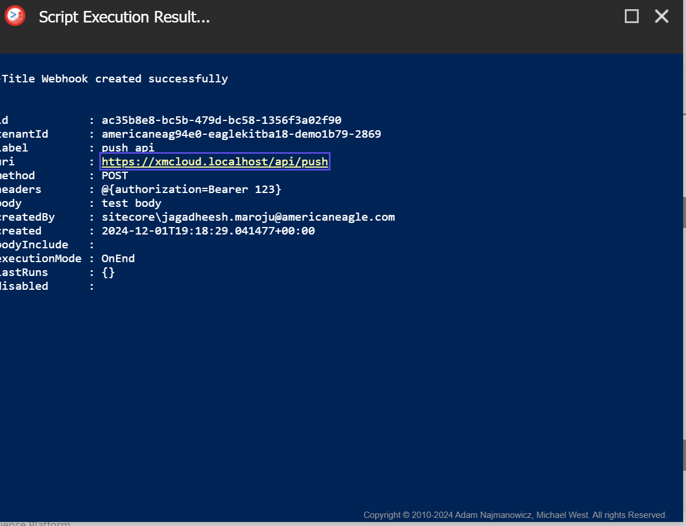

- List webhooks

    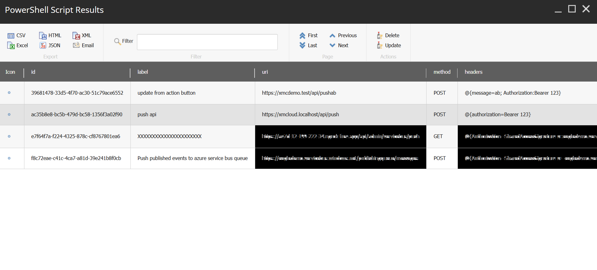

- Update webhook [Select the webhook from the list and then click on update webhook]

    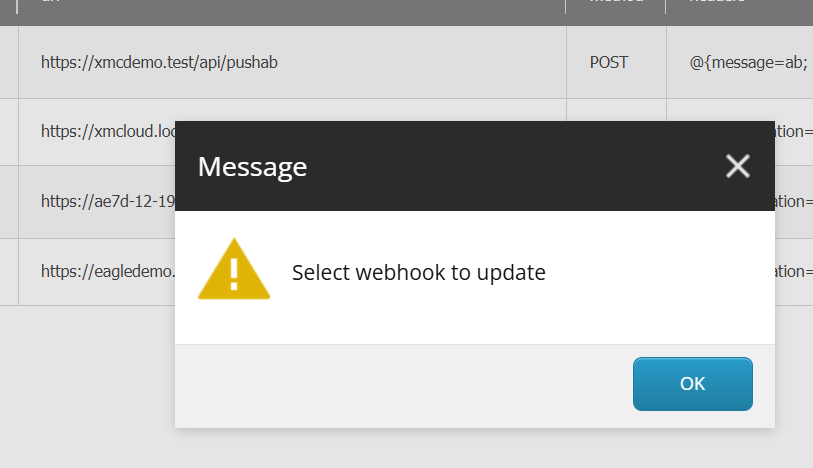

    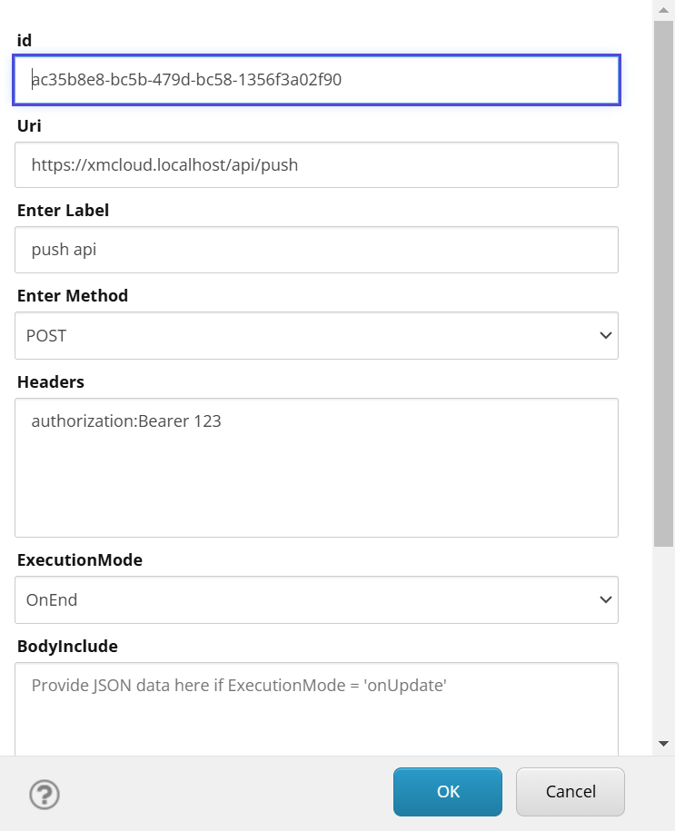

    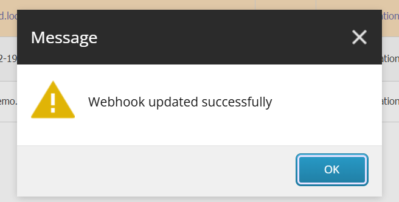

- Delete webhook [Select the webhook from the list and then click on delete webhook]

    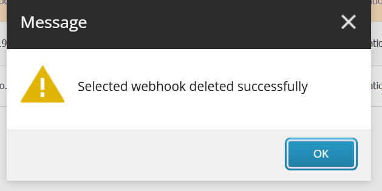

 
